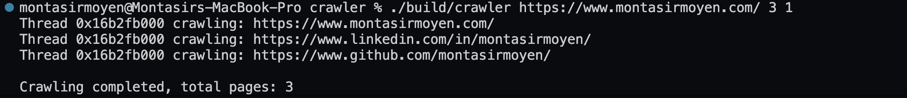

# crawler
A high-performance application designed to recursively traverse the web by leveraging a multi-threaded architecture and robust synchronization primitives for concurrency and resource management.


Initially created to explore multi-threading in a more applied way, beyond the Operating Systems class I'm taking this semester.

## Usage
```
git clone https://github.com/montasirmoyen/crawler
cd crawler
cmake -S . -B build
cmake --build build
./build/crawler <url> <limit> <num_threads>
```
**Example Usage**
```
./build/crawler https://www.montasirmoyen.com/ 3 1  
```
